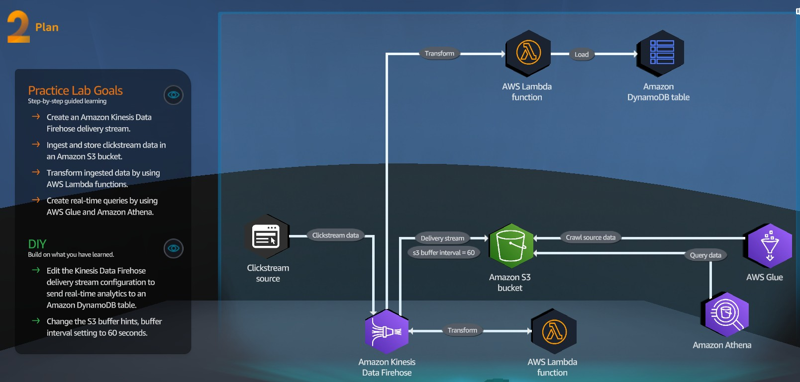

# Lab 9. Data Ingestion Methods
> Help the package delivery company speed up data ingestion and transformation.



## Practice
1. Kinesis
   - Create Kinesis Data Firehose delivery stream `ClickStreamData` 
   - Source: Direct PUT, Destination: S3
   - Transform: enable and choose Lambda function [DataProcessingFunction](process_data.py)
   - Destination: shoose S3 bucket `databucket-*` with prefix `processed_data/` and for errors `error/`
   - Advanced settings: choose existing IAM role `LabKinesisFirehoseRole` 
2. Glue
   - Add database `firehose-inbound`
   - Add table using crawler `crawl_processed_data`
     - Add data source: S3 bucket `databucket-*/processed_data/`
     - Create new IAM role `AWSGlueServiceRole-DataIngestion`
     - Target database - choose `firehose-inbound`
     - Crawler Schedule - set Custom (`*/5` - every 5 min)
3. EC2
   - Open public IP of Web UI instance - IP/firehose
   - Start streaming into Kinesis Data Firehose delivery stream `ClickStreamData` 
4. AWS Lambda
   - Review function [DataProcessingFunction](process_data.py)
5. DynamoDB
   - Review empty table `OutputTable` 
6. S3
   - Review [data](ClickStreamData-1-2023-10-12-07-01-46-e176b602-265c-4f1f-99fb-297fef70d3cb) at bucket `databucket-*/processed_data/`
7. Glue
   - Review a work of crawler
8. Athena
   - Lunch Query editor
   - Choose `AwsDataCatalog.firehose-inbound`
   - Settings: choose S3 bucket
   - Run preview of table `processed_data` and then run SQL script:
   
```sql
select col2 as source, count(*) as count 
from "firehose-inbound"."processed_data"
where col2 in ('external', 'link')
group by "col2"
```

## DIY
> Edit the Kinesis Data Firehose delivery stream configuration to send real-time 
> analytics to an Amazon DynamoDB table

1. Kinesis 
   - Data Firehose -> ClickStreamData -> Configuration -> Transform and convert records -> Edit
     - Change Lambda function to [DataAnalyticsFunction](analytics.py)

> Change the S3 buffer hints, buffer interval settings to 60 seconds.

1. Kinesis 
   - Data Firehose -> ClickStreamData -> Configuration -> Destination settings -> Edit
     - Change `Buffer interval` to 60 seconds